<p align="center">
  <picture>
    <source media="(prefers-color-scheme: dark)" srcset="logo/cc-pacer-logo-dark.svg">
    
  </picture>
</p>

<h1 align="center">cc-pacer</h1>

<p align="center"><em>Know your pace before you hit the wall.</em></p>

<p align="center">
  
</p>

Configure your Claude Code statusline to show limits, cost, directory and git info


```
Fable 5 │ ✍️ 43% │ myrepo (main*) ↑2 │ ⏱ 42m · $1.23 │ +156/-23 │ ◑ medium │ 🎙● 🖥●

current ●●●○○○○○○○  34%→68% ⟳ 6:41pm · $2.10 🔥 $0.84/hr
weekly  ●●○○○○○○○○  18% ⟳ jul 17, 9:00am · $14.32
month   $52.80 api-equiv · today $4.15
```

What you get, no configuration needed:

- **Line 1** — model, context %, directory + git branch (`*` = dirty, `↑n↓n` = commits ahead/behind upstream, `⚡` = `--dangerously-skip-permissions`), session duration + session cost, lines added/removed, reasoning effort, and two toggles: 🎙 voice mode and 🖥 remote control (green = on).
- **Meters** — your official 5-hour and weekly rate-limit windows with reset times, each annotated with what that usage would have cost on the API. The percentage is colored by your projected end-of-window usage (`→68%`) so being ahead of pace flags early. `🔥 $/hr` is your burn rate over the current 5-hour block.
- **month** — your calendar-month API-equivalent spend and today's total. An extra-usage meter appears too when that data is available (it comes from the usage API fallback below).

Costs are estimates computed locally from your transcripts (tokens × current API pricing, cached for 60s). When Claude Code doesn't provide rate-limit data on stdin (older versions), the script falls back to fetching it from Anthropic's usage API using your existing Claude Code credentials — that is the only network request it ever makes. Honors `CLAUDE_CONFIG_DIR` if you keep Claude's config outside `~/.claude`. Requires `jq` (see below).

## Install

```bash
npx cc-pacer
```

It backups your old status line if any and copies the status line script to `~/.claude/cc-pacer.sh` and configures your Claude Code settings.

## Requirements

- [jq](https://jqlang.github.io/jq/) — for parsing JSON
- curl — for fetching rate limit data
- git — for branch info

On macOS:

```bash
brew install jq
```

## Uninstall

```bash
node bin/install.js --uninstall
```

If you had a previous statusline, it restores it from the backup. Otherwise it removes the script and cleans up your settings.

## License

MIT
